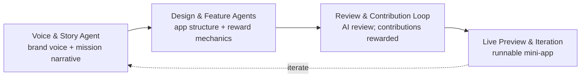

# Smart Community App Generator

[](./SovereignLicense.md)

An AI-workflow-driven generator that helps entrepreneurs spin up **community-powered sustainability / healthy-living apps** with built-in contribution-reward loops. The generator is itself a live demonstration of the Smart Assets ReFi business model: community contributions (data + reviews) are rewarded, and the build process follows the agent-orchestrated AI development workflows from the [smart-assets.io](https://gitlab.com/smart-assets.io/) GitLab profile.

> **Hackathon project** — GDG Newport Beach, Google I/O Extended (June 2026). Built standalone, deployable to Vercel from GitHub, with a ≤ 3-minute demo.

## Why

- Embodies the Smart Assets **ReFi vision** — regenerative, outcome-tied, community-financed.
- Extends the **BountyForge** coordination/incentive mindset into an AI-orchestrated Smart App builder.
- The generation process *is* the pitch: AI-guided Voice & Story → generated app via agent workflow → community contribution & reward in action.

## How It Works — The AI Workflow

A stateful, multi-agent [LangGraph.js](https://langchain-ai.github.io/langgraphjs/) `StateGraph` drives the flow. The **Voice & Story Agent** runs first and sets the voice that every downstream agent (and future contributor) must respect.



1. **Voice & Story Agent** *(first step)* — Guided AI-assisted creation of brand voice, mission narrative, and evangelization story. Outputs Zod-validated structured data consumed by every later agent. Initial user input is treated as a rewardable *contribution*.
2. **Design & Feature Agents** — Generate app structure, contribution flows, and reward mechanics consistent with the story and ReFi principles.
3. **Review & Contribution Loop** — AI-assisted review; contributions (data/reviews) are scored and rewarded, mirroring the business model.
4. **Live Preview & Iteration** — A runnable mini-app (the "Health Clean" example) with a working contribution → reward loop and placeholders for future smart-contract / ZK features.

## Stack

| Layer | Choice |
|-------|--------|
| Language / Runtime | TypeScript (strict) + Node.js |
| Framework | Next.js (App Router); Vite + React for lighter prototypes |
| Agent Orchestration | LangGraph.js (`StateGraph`) |
| Validation | Zod (agent structured outputs) |
| Styling | TailwindCSS + shadcn/ui (clean, nature-inspired ReFi aesthetic) |
| State | React state + TanStack Query / Zustand |
| Lint / Format | Biome |
| Testing | Vitest |
| Deployment | Vercel (one-command from GitHub) |
| Optional hybrid | uv/Python services via FastAPI for heavier computation |

## UI Overview

- **Sidebar navigation**: Voice & Story (workflow start) · Generate App (agent orchestration) · Preview · Community Impact & Contributions.
- **Wizard flow**: Story → Design → Generate → Review/Contribute → Iterate, with a live LangGraph execution trace for the demo.
- **Generated app preview** (Health Clean): tabbed Home/Dashboard · Contribute · My Rewards · Community, with a working contribution form and reward preview.
- **Key components**: `VoiceStoryForm`, `ContributionCard`, `ImpactDashboard`, `GeneratedAppPreview`.

## Repository Structure

```
T500GoogHackathon/
├── README.md                # This file
├── SmartAppPlan.md          # Overall hackathon plan and AI-workflow flow
├── VoiceStoryAgent.md       # Voice & Story agent spec + LangGraph state schema (Option A)
├── UILayout.md              # UI layout and component structure (Option B)
├── 3MinuteDemoScript.md     # 3-minute demo script (Option C)
├── CLAUDE.md                # AI-assistant guidance (single source of truth)
├── AGENTS.md                # Condensed guidance (Codex/Copilot/Cursor)
├── GEMINI.md                # Gemini CLI pointer to CLAUDE.md
├── SovereignLicense.md      # Sovereign Source License (SSL) v0.3
└── docs/                    # Stigmergic task tracking
    ├── ToDos.md  UserStories.md  User-Flows.md
    ├── Backlog.md  CompletedTasks.md  roadmap.md
```

## Getting Started

> The Next.js app scaffold is pending; these are the intended commands once `package.json` exists.

```bash
npm install            # or pnpm install
cp .env.example .env   # add LLM provider API keys (never commit)
npm run dev            # start the dev server
npm run build          # production build
npx biome check --write .   # lint + format
npm run test           # Vitest
```

Provider API keys (e.g. `ANTHROPIC_API_KEY`) live in environment variables only — see `.env.example`.

## Demo (≤ 3 minutes)

1. **0:00–0:40** — Introduce the problem and the generator.
2. **0:40–1:40** — Live Voice & Story creation; show the agent and generated Voice Profile + Narrative.
3. **1:40–2:30** — Run the full multi-agent workflow; preview the Health Clean app; submit a contribution and see it rewarded.
4. **2:30–3:00** — Close on the contribution-reward business model, future smart-contract / ZK integration, and the deployed link.

See [3MinuteDemoScript.md](./3MinuteDemoScript.md) for the full script.

## Documentation

- [SmartAppPlan.md](./SmartAppPlan.md) — plan, architecture, and gaps vs. existing Smart Assets approaches
- [VoiceStoryAgent.md](./VoiceStoryAgent.md) — agent spec, state schema, and prompt template
- [UILayout.md](./UILayout.md) — screens, components, and styling
- [CLAUDE.md](./CLAUDE.md) — guidance for AI coding assistants (the canonical project reference)

## Contributing

This project uses **stigmergic collaboration** — coordinate through the shared `.md` files in `docs/` (read `docs/ToDos.md` before starting). See [CLAUDE.md](./CLAUDE.md) for git conventions, code style, security/PII rules, and development modes.

## License

Licensed under the **Sovereign Source License (SSL) v0.3** — see [SovereignLicense.md](./SovereignLicense.md). SSL extends Apache 2.0 with an optional ecosystem layer (data spigot, SATCHEL, ecosystem credits); all Apache 2.0 rights and freedoms are preserved. Canonical text: [smart-assets.io/SovereignLicense](https://gitlab.com/smart-assets.io/SovereignLicense).
