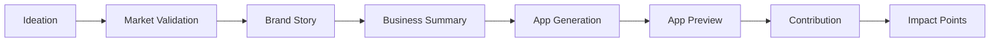

# 3-Minute Demo Script - Updated for Six-Step Wireframes

**Total time:** <= 3 minutes  
**Primary demo path:** live React app using the updated side-nav workflow  
**Wireframe sequence:** Ideation -> Market Validation -> Brand Story -> Business Summary -> App Generation -> App Preview  
**Sample generated app:** Clean Health  
**Reward language:** impact points only

## Core Message for Judges

Smart Community App Generator solves a real Ticket 500 problem: early founders
need to turn a rough community-impact idea into a clear story, structured app
concept, and contribution loop quickly enough to test with users, judges, and
partners.

The differentiated idea is not "another app template." It is a story-led,
AI-orchestrated generator where the founder's brief becomes market validation,
brand narrative, app structure, and a built-in contribution -> impact-points loop.

## Setup Before Recording or Presenting

- Start on the Ideation screen with the left workflow navigation visible.
- Have a short Clean Health idea ready to paste into the three Ideation fields.
- Use the live Voice Story generation if provider credentials are available.
- Keep a pre-generated Voice Story result or screenshot ready as fallback if the provider is slow or unavailable.
- Rehearse the Clean Health generation run-through: Generate Clean Health preview -> Pipeline Status -> Clean Health generated PWA -> App Metadata -> Contribution Logic.
- Do not present impact points as tokens, claimable assets, or live smart-contract rewards.

## Timed Run of Show

### 0:00-0:20 - Open on the Workflow

Show the side navigation and the first Ideation screen.

Say:

"This is Smart Community App Generator. It solves a real Ticket 500 founder problem: turning a rough community-impact idea into a clear story, app blueprint, and testable demo before momentum is lost. In three minutes, I will turn a healthy-living idea into a generated Clean Health app with a visible contribution and impact-point loop."

Point out the six-step flow in the side nav:

Ideation, Market Validation, Brand Story, Business Summary, App Generation, App Preview.

### 0:20-0:45 - Ideation: Problem, Solution, Success

Enter or paste the prepared idea brief:

- Problem: neighbors want practical clean-health habits, but trusted local examples are scattered.
- Solution: a community app where members share clean-eating reviews and habit swaps.
- Success: useful contributions create visible community learning and impact points.

Say:

"The founder starts with problem, solution, and success. This becomes the shared brief for every downstream agent so the story, product, and reward loop do not drift apart."

Add if time allows:

"That is the practical value for Ticket 500: one guided workflow replaces separate strategy, copy, app-planning, and reward-design passes."

Advance to Market Validation.

### 0:45-1:05 - Market Validation: Emulated Research

Show the Market Validation score and the four research cards: market signals, comparable patterns, audience signal, risks and opportunities.

Say:

"For the hackathon, market validation is clearly labeled emulated. It still demonstrates the handoff shape: audience, comparables, risks, and contribution opportunities that will later be supplied by live research tooling."

Add if time allows:

"This is also where the idea becomes differentiated: the app is not just generated from a prompt; it is generated from a validated community problem and an explicit contribution model."

Advance to Brand Story.

### 1:05-1:45 - Brand Story: Voice and Story Agent

Show the seeded prompt, then click **Generate Story**.

Say while it runs:

"The Voice and Story agent runs server-side, so provider keys never reach the browser. Its job is not just copywriting. It creates the voice profile, narrative, and Story Engine that the generated app must follow."

Add if time allows:

"AI is used here as workflow infrastructure. It produces structured outputs that gate the next step, rather than decorative text pasted onto a static template."

When results appear, show:

- ABT pitch
- Voice Profile
- Story Spine or narrative hook
- Handoff to Business Summary

If the provider is slow or unavailable, say:

"The live provider is taking longer than the demo window, so I am switching to the prepared generated result. The important contract is the same: structured story output gates the next step."

Advance to Business Summary.

### 1:45-2:05 - Business Summary: Blueprint Before Generation

Show the Clean Health app name, mission statement, product-story fit, contribution-loop clarity, and Brand Story highlights.

Say:

"The Business Summary compresses ideation, validation, and story into the app blueprint. Notice the language stays practical and demo-safe: Clean Health, community learning, and impact points only."

Add if time allows:

"This screen shows the build structure: the idea is carried forward as typed artifacts, then turned into app metadata, product-story fit, contribution-loop clarity, and generation inputs."

Advance to App Generation.

### 2:05-2:35 - Clean Health App Generation Run-Through

Click **Generate Clean Health preview** and show the pipeline status moving to ready.

Say:

"Now the app-generation step turns the blueprint into a Clean Health app. The generator is assembling the product structure, contribution flow, reward mechanics, and preview shell from the same story and business summary we just created."

Run through the visible generation stages:

- **Designing structure:** point to "Layout and architecture validated."
- **Building contribution flow:** point to "Defining regenerative loops."
- **Creating reward mechanics:** point to "Impact-point rules queued."
- **Assembling preview:** point to "Finalizing visual assets."

After clicking generate, show completion moving from 64% to 100% and the **Clean Health preview ready** confirmation.

Say:

"This is the build quality story: each step has a clear contract, and the generated output is not free-form text. It becomes a structured app preview with tabs, metadata, and impact-point logic."

Add if time allows:

"The product is structured as a six-step React workflow with server-side agent slices and Zod-validated outputs, so each phase has a clear contract."

Advance to App Preview.

### 2:35-2:58 - Generated Clean Health App Preview

Show the Clean Health generated PWA preview.

Run through the generated app:

- **Home:** show "Saturday clean-health circle" and the reward-available prompt.
- **App Metadata:** point to Project name: Clean Health, Network: Demo ledger, Reward unit: Impact points, Logic engine: Contribution scoring.
- **Contribution Logic:** point to Clean-eating review -> 25 impact points.
- **Contribute tab:** enter a short clean-eating review and submit it.

Show the Rewards or Community tab after submission.

Say:

"Here is the loop the generator builds into the app: a simulated community member submits a useful contribution, the demo ledger credits 25 impact points, and the community metrics update from 1,240 to 1,265 points."

Point to the future verification note.

Say:

"Future proof-based verification can be added later, but this demo does not imply live tokens or claimable assets."

### 2:58-3:00 - Close

Say:

"The generator demonstrates the same model it helps founders create: a story-led community app with contribution, reward, and iteration built into the workflow."

End on the deployed app link or the App Preview screen.

## Judge Question Coverage

- **Does it solve a real, meaningful problem for Ticket 500?** Yes. The opening and Ideation sections explain that Ticket 500 founders need a fast path from rough idea to story, app blueprint, and testable contribution loop.
- **Is the idea creative or differentiated?** Yes. The script frames the product as a story-led AI generator with built-in contribution mechanics, not a generic template generator.
- **How well is it built and structured?** The six-step side-nav flow, typed handoffs, Clean Health generation run-through, server-side agent slices, and Zod-validated outputs are called out in Business Summary, App Generation, and the architecture fallback.
- **Is AI used in a meaningful way?** The Brand Story section explains that AI creates structured workflow artifacts that drive downstream generation, not just marketing copy.
- **Is the idea clearly communicated?** The opening uses one sentence for the problem, one for the demo promise, and the close repeats the core model: story-led app generation with contribution, reward, and iteration.

## Backup Architecture Talking Point

If asked about implementation, summarize it in one sentence:

"The React workflow is backed by server-side agent slices with Zod-validated structured outputs, starting with Voice and Story and expanding toward research, app generation, and reward scoring."

Optional backup diagram:

## Presenter Guardrails

- Use the updated screen names from the side nav.
- Keep Market Validation described as emulated unless live research is implemented.
- Keep Clean Health as the generated app example.
- Say "impact points", not tokens, coins, airdrops, or claimable rewards.
- Keep smart-contract and ZK references as future verification only.
- Prioritize the contribution submission and +25 impact-point confirmation if time gets tight.
