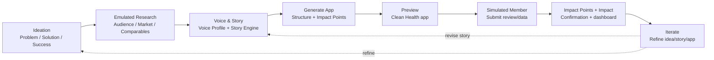

# Initial Wireframes - Proposed Draft

**Date:** 2026-06-20  
**Status:** Proposed, clarification applied  
**Source epic:** `EPIC-001` / `TASK-001-2` in `docs/ToDos.md`

## Reviewed Context

This proposal is grounded in:

- `docs/User-Flows.md`
  - `FLOW-002`: Ideation - Business Idea Refinement
  - `FLOW-001`: Voice & Story Generation
  - Newly required `FLOW-003+` downstream journeys
- `docs/ToDos.md`
  - `EPIC-001`: Initial project wireframes, priority `p0`
  - Requirement to start with user workflows and UI problem framing
- `docs/UserStories.md`
  - `US-002`: Guided business-idea refinement
  - `US-001`: Voice & Story generation engine
- `docs/designs/UILayout.md`
  - Problem -> Story -> Design -> Generate -> Review/Contribute -> Iterate
  - Canonical navigation decision: side navbar
- `docs/SmartAppPlan.md`
  - AI workflow: Voice & Story -> Design & Feature Agents -> Review &
    Contribution Loop -> Live Preview & Iteration
- `docs/3MinuteDemoScript.md`
  - Demo target: <= 3 minutes
  - Show Voice & Story, generated Clean Health app, contribution -> reward
- `docs/VoiceStoryAgent.md`
  - Voice & Story output drives downstream agents and future contributions
- Current React implementation
  - `IdeationForm`, `WizardStepper`, `VoiceStoryForm`, `StoryResult`
  - Implementation gap: current stepper should move to side navbar

## Resolved Product Decisions

1. **Navigation:** use a side navbar as the canonical app shell.
2. **Research:** emulate Agentic Research for now; do not require a real research
   agent for the initial demo.
3. **Generated app example:** use **Clean Health**.
4. **Contribution viewpoint:** simulate a community member contributing to the
   generated app.
5. **Reward language:** use **impact points**.
6. **Smart-contract/ZK treatment:** keep it subtle as a future verification note,
   not a prominent feature.
7. **Workflow coverage:** formalize Research, Generate App, Preview, and
   Contribution/Reward as `FLOW-003+` entries before implementation hardening.

## Product Framing

### User Problem

The Ticket 500 Entrepreneur needs to turn a rough community-app idea into a
coherent story, app concept, and live demo quickly. Today, the story, product
structure, and contribution/reward loop are usually created separately, which
causes product and marketing drift.

### Proposed Solution

A guided AI workflow asks for the founder's problem, solution, and success
criteria, then uses that confirmed brief to drive emulated research, Voice &
Story generation, app generation, and a runnable Clean Health preview with a
visible contribution -> impact points -> impact loop.

### UI Process

1. Capture the business idea as problem, solution, and success.
2. Confirm the idea brief and hand it to emulated Agentic Research.
3. Use research and the idea brief to seed Voice & Story generation.
4. Show the generated story artifacts that downstream agents must respect.
5. Generate an app structure and impact-point mechanics from that story.
6. Preview Clean Health and demonstrate a simulated member contribution.
7. Summarize impact points and community impact, then invite iteration.

## Primary Workflow Model



## Global Layout Wireframe

Use a persistent side navbar so the demo audience can always see where the
founder is in the generation pipeline.

```text
┌──────────────────────────────────────────────────────────────────────┐
│ ┌ Side nav ───────────────┐ ┌ Main workspace ─────────────────────┐ │
│ │ Smart Community         │ │ Step N: Active Step                 │ │
│ │ App Generator           │ │ Problem / solution / process copy   │ │
│ │                         │ │                                     │ │
│ │ 1. Ideation             │ │ Active form, generated artifact,    │ │
│ │ 2. Research (emulated)  │ │ or Clean Health preview             │ │
│ │ 3. Voice & Story        │ │                                     │ │
│ │ 4. Generate App         │ │ Context / handoff panel             │ │
│ │ 5. Preview              │ │                                     │ │
│ │                         │ └─────────────────────────────────────┘ │
│ │ Future: install PWA     │ ┌ Footer controls ────────────────────┐ │
│ └─────────────────────────┘ │ [Back]            [Next / Action]   │ │
│                             └─────────────────────────────────────┘ │
└──────────────────────────────────────────────────────────────────────┘
```

### Global Interaction Rules

- Upcoming steps are disabled until prerequisites are satisfied.
- Completed steps remain clickable so the entrepreneur can revise inputs.
- Each step shows the artifact it creates and how it feeds the next step.
- Emulated steps must be visibly labeled as emulated/demo data.
- Future smart-contract/ZK language appears as a subtle note only.

## Responsive Design Requirements

The canonical navigation is a side navbar, but the layout must adapt across
screen sizes without losing the workflow orientation.

- **Desktop / demo (`>= 1024px`)**
  - Navigation: persistent left side navbar.
  - Content: two-column opportunities allowed; generated app preview can sit
    beside artifact summaries.
- **Tablet (`768-1023px`)**
  - Navigation: narrow side rail with labels or collapsible side navbar.
  - Content: single-column forms; summary cards may wrap into two columns.
- **Mobile (`< 768px`)**
  - Navigation: side navbar becomes a drawer opened from a top "Workflow"
    button.
  - Content: forms, cards, traces, and preview tabs stack vertically with
    sticky Back/Next controls.

### Responsive Interaction Rules

- Preserve the same workflow order on every viewport: Ideation -> Research ->
  Voice & Story -> Generate App -> Preview.
- Keep touch targets at least 44px high on mobile.
- Ensure form labels remain visible above inputs; never rely on placeholder text
  alone.
- Stack Voice Profile, Story Narrative, Story Engine, and handoff panels on
  mobile.
- Render Clean Health as a responsive PWA preview: phone-like frame on desktop,
  full-width app surface on mobile.
- Keep contribution submission and impact-point confirmation visible without
  horizontal scrolling.
- Prefer CSS grid/flex wrapping over fixed pixel widths.

## Wireframe 1 - Ideation / Business Idea Refinement

**Supports:** `FLOW-002`, `US-002`  
**Goal:** Turn a vague founder prompt into a confirmed problem/solution/success
brief before any app or story is generated.

```text
┌──────────────────────────────────────────────────────────────────────┐
│ ┌ Side nav ───────────────┐ ┌ Ideation ───────────────────────────┐ │
│ │ ● Ideation              │ │ Problem -> Solution -> Success      │ │
│ │ ○ Research              │ │ "Start with the user problem. The   │ │
│ │ ○ Voice & Story         │ │ story and app will follow."        │ │
│ │ ○ Generate App          │ │                                     │ │
│ │ ○ Preview               │ │ 1. What problem are you solving?    │ │
│ │                         │ │ [textarea]                         │ │
│ │                         │ │ 2. How will the app solve it?       │ │
│ │                         │ │ [textarea]                         │ │
│ │                         │ │ 3. What does success look like?     │ │
│ │                         │ │ [textarea]                         │ │
│ │                         │ │                                     │ │
│ │                         │ │ ┌ Idea brief preview ────────────┐ │ │
│ │                         │ │ │ Problem / Solution / Success    │ │ │
│ │                         │ │ │ Status: complete all fields     │ │ │
│ │                         │ │ └────────────────────────────────┘ │ │
│ └─────────────────────────┘ └─────────────────────────────────────┘ │
│                               [Back disabled] [Next: Research]       │
└──────────────────────────────────────────────────────────────────────┘
```

### Ideation Notes

- Current `IdeationForm` captures all three fields at once. The flow language
  says the assistant should reflect each answer back for confirmation. The
  first implementation can show a live brief preview; a later version can add
  per-answer confirmation.
- Above the fold, say: "Define the problem once; every agent uses the same
  brief."

## Wireframe 2 - Emulated Agentic Research

**Supports:** `FLOW-003`, `US-003`  
**Goal:** Validate and enrich the idea brief before Voice & Story generation,
using emulated demo output for now.

```text
┌──────────────────────────────────────────────────────────────────────┐
│ ┌ Side nav ───────────────┐ ┌ Research ───────────────────────────┐ │
│ │ ✓ Ideation              │ │ Emulated Agentic Research           │ │
│ │ ● Research              │ │ "Research agents turn your brief    │ │
│ │ ○ Voice & Story         │ │ into evidence for story/design."    │ │
│ │ ○ Generate App          │ │                                     │ │
│ │ ○ Preview               │ │ ┌ Confirmed idea brief ──────────┐ │ │
│ │                         │ │ │ Problem / Solution / Success    │ │ │
│ │                         │ │ └────────────────────────────────┘ │ │
│ │                         │ │ ┌ Emulated research trace ───────┐ │ │
│ │                         │ │ │ ✓ Audience signal              │ │ │
│ │                         │ │ │ ✓ Comparable apps              │ │ │
│ │                         │ │ │ ✓ Reward opportunities         │ │ │
│ │                         │ │ │ ✓ Risks and assumptions        │ │ │
│ │                         │ │ └────────────────────────────────┘ │ │
│ │                         │ │ Audience | Market gap | Reward idea │ │
│ └─────────────────────────┘ └─────────────────────────────────────┘ │
│                               [Back] [Next: Voice & Story]          │
└──────────────────────────────────────────────────────────────────────┘
```

### Research Notes

- Label output as **Emulated** to avoid implying a live research agent exists.
- The output should become a `ResearchBrief` artifact when the real agent is
  implemented.

## Wireframe 3 - Voice & Story Input

**Supports:** `FLOW-001`, `US-001`, `VoiceStoryForm`  
**Goal:** Generate the brand voice and story engine from the confirmed idea and
emulated research.

```text
┌──────────────────────────────────────────────────────────────────────┐
│ ┌ Side nav ───────────────┐ ┌ Voice & Story ──────────────────────┐ │
│ │ ✓ Ideation              │ │ "This story will guide every        │ │
│ │ ✓ Research              │ │ generated screen and contribution   │ │
│ │ ● Voice & Story         │ │ ask."                              │ │
│ │ ○ Generate App          │ │                                     │ │
│ │ ○ Preview               │ │ ┌ Seeded prompt ─────────────────┐ │ │
│ │                         │ │ │ Problem/Solution/Success +     │ │ │
│ │                         │ │ │ emulated research summary       │ │ │
│ │                         │ │ │ [editable textarea]             │ │ │
│ │                         │ │ └────────────────────────────────┘ │ │
│ │                         │ │ [Generate Story]                  │ │
│ │                         │ │ Server-side LLM only              │ │
│ │                         │ │ idle | generating | success | err  │ │
│ └─────────────────────────┘ └─────────────────────────────────────┘ │
│                               [Back] [Next disabled until generated] │
└──────────────────────────────────────────────────────────────────────┘
```

### Voice Input Notes

- Current `VoiceStoryForm` seeds from `IdeaBrief`; wireframe assumes the
  emulated research summary can be added later.
- The founder's idea should be framed as the first contribution to the generated
  community.

## Wireframe 4 - Voice & Story Results

**Supports:** `StoryResult`  
**Goal:** Make generated story artifacts easy to scan during a live demo.

```text
┌──────────────────────────────────────────────────────────────────────┐
│ ┌ Side nav ───────────────┐ ┌ Voice & Story Results ──────────────┐ │
│ │ ✓ Ideation              │ │ "Your app now has a voice, story,   │ │
│ │ ✓ Research              │ │ and contribution narrative."        │ │
│ │ ● Voice & Story         │ │                                     │ │
│ │ ○ Generate App          │ │ ┌ Voice Profile ┐ ┌ Narrative ───┐ │ │
│ │ ○ Preview               │ │ │ Tone           │ │ Mission     │ │ │
│ │                         │ │ │ Personality    │ │ Problem     │ │ │
│ │                         │ │ │ Values         │ │ Solution    │ │ │
│ │                         │ │ └───────────────┘ └──────────────┘ │ │
│ │                         │ │ ┌ Story Engine ──────────────────┐ │ │
│ │                         │ │ │ ABT | Spine | Statement |      │ │ │
│ │                         │ │ │ Proverb | Metaphor             │ │ │
│ │                         │ │ └────────────────────────────────┘ │ │
│ │                         │ │ Handoff: tone / contribution ask / │ │
│ │                         │ │ impact-point promise               │ │
│ └─────────────────────────┘ └─────────────────────────────────────┘ │
│                               [Back] [Next: Generate App]           │
└──────────────────────────────────────────────────────────────────────┘
```

### Story Result Notes

- Add the handoff region even if it is initially static. It makes clear why the
  story matters to downstream agents.
- The demo should highlight one ABT pitch and one contribution ask, not require
  judges to read every field.

## Wireframe 5 - Generate App / Agent Workflow Trace

**Supports:** `FLOW-004`, `US-004`  
**Goal:** Show agent orchestration and the transformation from story to app.

```text
┌──────────────────────────────────────────────────────────────────────┐
│ ┌ Side nav ───────────────┐ ┌ Generate App ───────────────────────┐ │
│ │ ✓ Ideation              │ │ "Agents convert the story into      │ │
│ │ ✓ Research              │ │ screens, features, and impact       │ │
│ │ ✓ Voice & Story         │ │ points."                            │ │
│ │ ● Generate App          │ │                                     │ │
│ │ ○ Preview               │ │ ┌ Workflow trace ─────────────────┐ │ │
│ │                         │ │ │ ✓ Voice & Story accepted        │ │ │
│ │                         │ │ │ ~ Design agent: app map         │ │ │
│ │                         │ │ │ ~ Feature agent: impact points  │ │ │
│ │                         │ │ │ • Review agent: consistency     │ │ │
│ │                         │ │ │ • Preview builder: Clean Health │ │ │
│ │                         │ │ └────────────────────────────────┘ │ │
│ │                         │ │ App map | Components | Impact rules │ │
│ │                         │ │ Note: future verification planned  │ │
│ └─────────────────────────┘ └─────────────────────────────────────┘ │
│                               [Back] [Next: Preview App]            │
└──────────────────────────────────────────────────────────────────────┘
```

### Generation Notes

- This screen is the clearest place to show LangGraph orchestration.
- Keep the smart-contract/ZK reference as a subtle note such as "future
  verification planned" rather than a primary card.

## Wireframe 6 - Clean Health Preview Shell

**Supports:** `FLOW-005`, `US-005`, planned `GeneratedAppPreview`  
**Goal:** Show the runnable generated Clean Health example.

```text
┌──────────────────────────────────────────────────────────────────────┐
│ ┌ Side nav ───────────────┐ ┌ Preview: Clean Health ──────────────┐ │
│ │ ✓ Ideation              │ │ "A community-powered app where      │ │
│ │ ✓ Research              │ │ healthy contributions earn impact   │ │
│ │ ✓ Voice & Story         │ │ points."                            │ │
│ │ ✓ Generate App          │ │                                     │ │
│ │ ● Preview               │ │ ┌ App frame ──────────────────────┐ │ │
│ │                         │ │ │ Clean Health     Impact: 1,240  │ │ │
│ │                         │ │ │ [Home] [Contribute] [Rewards]   │ │ │
│ │                         │ │ │ [Community]                     │ │ │
│ │                         │ │ │                                 │ │ │
│ │                         │ │ │ Today's challenge               │ │ │
│ │                         │ │ │ Recent member contributions     │ │ │
│ │                         │ │ │ Impact point pool preview       │ │ │
│ │                         │ │ └─────────────────────────────────┘ │ │
│ │                         │ │ Next: simulate member contribution │ │
│ └─────────────────────────┘ └─────────────────────────────────────┘ │
│                               [Back] [Open Contribute Tab]          │
└──────────────────────────────────────────────────────────────────────┘
```

### Preview Shell Notes

- Use a desktop app shell for the hackathon demo, but frame Clean Health as a
  mobile-friendly PWA.
- Keep the generated app name consistent: **Clean Health**.

## Wireframe 7 - Simulated Contribution -> Impact Points -> Impact

**Supports:** `FLOW-006`, `US-006`, planned `ContributionCard` and
`ImpactDashboard`  
**Goal:** Demonstrate the ReFi loop in under 50 seconds.

```text
┌──────────────────────────────────────────────────────────────────────┐
│ ┌ Side nav ───────────────┐ ┌ Preview: Clean Health / Contribute ─┐ │
│ │ ✓ Ideation              │ │ Simulated community member view      │ │
│ │ ✓ Research              │ │                                     │ │
│ │ ✓ Voice & Story         │ │ ┌ App frame ──────────────────────┐ │ │
│ │ ✓ Generate App          │ │ │ [Home] [Contribute*] [Rewards]  │ │ │
│ │ ● Preview               │ │ │ [Community]                     │ │ │
│ │                         │ │ │ Submit a contribution           │ │ │
│ │                         │ │ │ Type: Clean eating review       │ │ │
│ │                         │ │ │ What did you learn/share?       │ │ │
│ │                         │ │ │ [textarea]                      │ │ │
│ │                         │ │ │ Reward preview                  │ │ │
│ │                         │ │ │ +25 impact points | pending     │ │ │
│ │                         │ │ │ [Submit Contribution]           │ │ │
│ │                         │ │ └─────────────────────────────────┘ │ │
│ │                         │ │ Contribution received.             │ │
│ │                         │ │ +25 impact points credited.        │ │
│ │                         │ │ Subtle note: future proof-based    │ │
│ │                         │ │ verification planned.              │ │
│ └─────────────────────────┘ └─────────────────────────────────────┘ │
└──────────────────────────────────────────────────────────────────────┘
```

### Reward Loop Notes

- The contributor is a simulated community member.
- The reward is **impact points** only; avoid token-claim language.
- Smart-contract/ZK is a subtle future verification note.

## Wireframe 8 - Iterate / End State

**Supports:** Live Preview & Iteration  
**Goal:** End the demo by showing the process can continue.

```text
┌──────────────────────────────────────────────────────────────────────┐
│ ┌ Side nav ───────────────┐ ┌ Preview Complete ───────────────────┐ │
│ │ ✓ Ideation              │ │ Your Clean Health draft is ready    │ │
│ │ ✓ Research              │ │ to iterate.                         │ │
│ │ ✓ Voice & Story         │ │                                     │ │
│ │ ✓ Generate App          │ │ Generated:                          │ │
│ │ ● Preview               │ │ Voice & Story | Research notes      │ │
│ │                         │ │ App map | Impact-point loop | Demo  │ │
│ │                         │ │                                     │ │
│ │                         │ │ Next actions:                       │ │
│ │                         │ │ [Refine idea] [Regenerate story]    │ │
│ │                         │ │ [Adjust impact points] [Export]     │ │
│ │                         │ │                                     │ │
│ │                         │ │ "The generator demonstrates the     │ │
│ │                         │ │ same contribution/reward model its  │ │
│ │                         │ │ generated apps can use."           │ │
│ └─────────────────────────┘ └─────────────────────────────────────┘ │
└──────────────────────────────────────────────────────────────────────┘
```

## Demo Timing Map

```text
0:00-0:25  Problem and product promise (Ideation screen)
0:25-0:55  Fill/confirm problem, solution, success
0:55-1:10  Emulated Research handoff
1:10-1:50  Generate Voice & Story and show one story artifact
1:50-2:20  Generate App trace and Clean Health preview
2:20-2:50  Simulated member contribution and impact points
2:50-3:00  Close on iteration + subtle future verification note
```

## Implementation Handoff

### Current Components to Keep

- `IdeationForm`
- `VoiceStoryForm`
- `StoryResult`

### Current Component to Replace or Refactor

- `WizardStepper`
  - Replace with a side-navbar workflow navigation component, or refactor it
    into a vertical side nav.

### Proposed New Components

- `WorkflowSideNav`
  - Persistent side nav with status markers and gated navigation.
- `IdeaBriefPreview`
  - Shows live problem/solution/success summary and completion state.
- `ResearchStep`
  - Emulated now; later renders research trace and summary cards.
- `StoryHandoffPanel`
  - Extracts design tone, contribution ask, and impact-point promise.
- `GenerationTrace`
  - Shows agent statuses and generated artifacts.
- `GeneratedAppPreview`
  - Renders Clean Health app shell and tabs.
- `ContributionCard`
  - Simulated community member contribution form with impact-point preview.
- `RewardConfirmation`
  - Post-submit confirmation and subtle future verification note.
- `ImpactDashboard`
  - Summary metrics for contributions and impact points.

### Gaps to Resolve

- Add formal `FLOW-003+` entries for Research, Generate App, Preview, and
  Contribution/Reward before implementation hardening.
- Update `src/App.tsx` from horizontal stepper to side navbar.
- Update docs and copy from "Health Clean" to **"Clean Health"**.
- Keep Agentic Research emulated until the real research agents exist.
- Keep rewards as impact points and avoid live token language.
